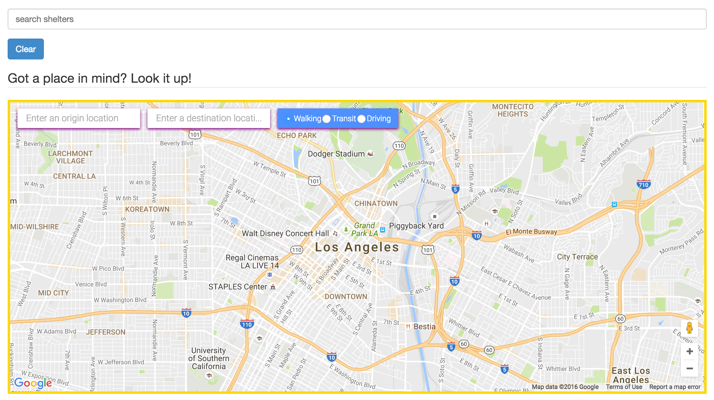

# <a href="https://safe-trek.herokuapp.com">Safe Trek</a>

<i>A Mapping service for the inner cities underprivileged.
This application will provide the homeless and economically 
troubled a resource of shelter locations and a community to 
communicate with online.</i>

### Lead Developer
<a href="http://alex1100.software">Alex Aleksanyan</a>

### Contributing Developer(s)
- <a href="https://keybase.io/dees">Brandon Dees</a>

- <a href="https://github.com/arun1595">Arun Kumar</a>

- <a href="http://www.kingsleyijomah.com/">Kingsley Ijomah</a>

### ERD

- 

# Technologies Used

- Ruby on Rails
- Google Embedded Maps API
- Google Distance Matrix API
- Google Street View API
- Google Places API
- Google Autocomplete and Directions API
- Google Maps API
- Bootstrap
- PostgreSQL
- jQuery
- JavaScript

